

  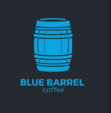

<h1 align="center">Blue Barrel Coffee - H1 2026 Report</h1>  

  
  

    

  
  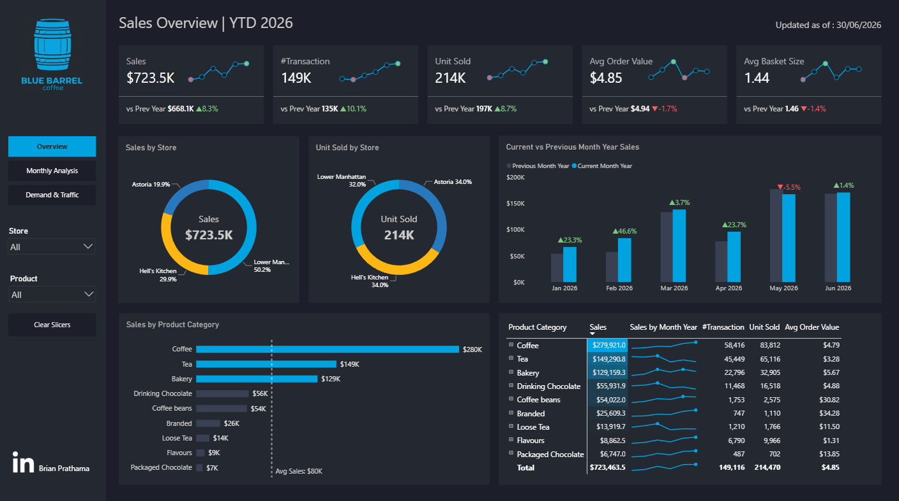  
  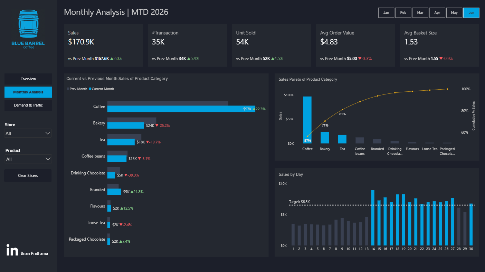  
  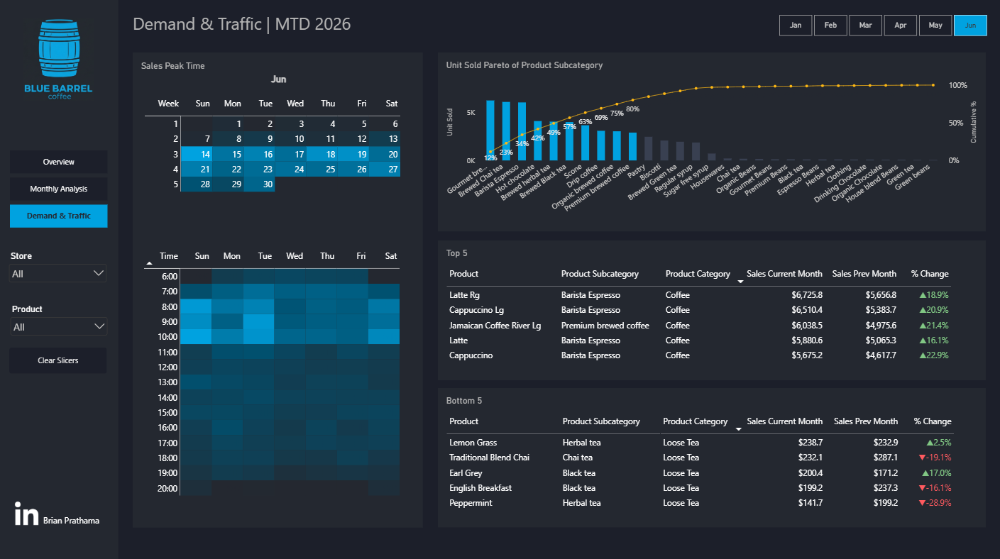

<table align="center">
  <tr>
    <td width="1440">
      <h2 align="center">Context</h2>
      <strong>Blue Barrel Coffee</strong> is a New York City coffee retailer operating three cafes: <strong>Astoria</strong>, <strong>Hell's Kitchen</strong>, and <strong>Lower Manhattan</strong>. It sells a variety of products like coffee as their primary product, and tea, also bakery items, drinking chocolate, retail beans, and branded merchandise.  
         
        This report is a pilot project in Blue Barrel Coffe as before this, the company doesn't have a comprehensive report/dashboard that can consolidate sales performance and demand/traffic analysis. Looking at the rise of new coffee shops around NYC, the company take a new approach to utilize sales data that they have (mostly in excel) to make more profound business decisions in hope to strengthen the company grip as the best coffee shop in NYC across three areas.   A newly appointed Head of Sales and Product decided to recruit one person for data team to make the consolidated report, as a proof of concept before deciding whether to build a data infrastructure to automate the consolidated report. After gathering the requirements, we finally get the available data for start.   This report is tracked through <strong>18 months</strong> of transaction-level sales data (January 2025 to June 2026), covering roughly <strong>426,000</strong> completed transactions and generating sales revenue exceeding <strong>$2 million</strong> across the period. The available data spans several dimensions, including store, product, category, and time-of-day / day-of-week.  
         Reporting to the Head of Sales and Product, an in-depth analysis was conducted to evaluate <strong>Blue Barrel's</strong> performance over the first half of 2026, benchmarked against the prior year. This report provides insights that leadership and cross-functional teams can use to validate informed business decisions like pricing, staffing, and product assortment decisions. The key insights and recommendations focus on the following areas:
      </body>
      <h3>Northstar Metrics</h3>
      <h4>
        <ul><li>Sales trends overall - Tracking sales revenue, transaction count, unit sold, average order value (AOV), and average basket size, year-over-year and month-over-month.</li>
          <li>Store performance - Comparing revenue, unit-sold share, and implied pricing across the three locations.</li>
          <li>Product & assortment - Analyzing category and subcategory contribution to identify the revenue core versus the long tail.</li>
          <li>Demand & traffic - Evaluating daily sales against target and hourly/weekday traffic patterns to inform staffing/promotion based on crowdedness.</li>
        </ul>
      </h4>
    </td>
  </tr>
</table>
<table align="center">
  <tr>
    

      <h1 align="center">Executive Summary</h1>
      <h3 align="center">Sales Performance (H1 2026 vs H1 2025)</h3>
      

        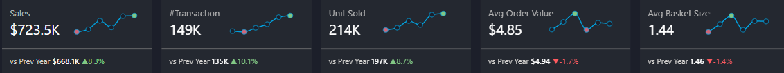
      

      <td width="460" valign="top">
        <ol>
          <li>
            <strong>Traffic-Led Sales Growth</strong>
            <ul>
              <li>YTD 2026 sales reached $723,464, up 8.3% over H1 2025's $668,150.</li>
              <li>In our initial analysis, sales growth was carried by more visits.</li> <li>Proven by #Transactions up 10.1%, units sold up 8.7% while Avg Order Value fell 1.7% and Avg Basket Size fell 1.4%.</li>
            </ul>
          </li>
          <li>
            <strong>But growth Is Decelerating Month by Month</strong>
            <ul>
              <li>YoY growth peaked in February 2026 (+46.6%), then decayed sharply, turning negative in May (-5.5%) for the first time in the period.</li>
              <li>June's recovery was only partial (+1.4%), well below the year's earlier pace.</li>
            </ul>
          </li>
        </ol>
      </td>
      <td width="460" valign="top">
        <ol start="3">
          <li>
            <strong>Then we found Lower Manhattan Store Pricing Question</strong>
            <ul>
              <li>Lower Manhattan generates 50.2% of sales from only 32.0% of units sold, a gap traced to store-level pricing rather than product mix.</li>
              <li>The size of that gap (up to 2.69x on identical products) is larger than real-world coffee-retail pricing norms, and is flagged for verification rather than presented as confirmed strategy.</li>
            </ul>
          </li>
          <li>
            <strong>Key Takeaways & Recommendations</strong>
            <ul>
              <li>Audit the store-level pricing data before making any pricing decision.</li>
              <li>Investigate and replicate the June 14 demand surge (explained below) and the consistent 7–10 AM daily traffic peak (for staffing).</li>
              <li>Rebuild basket size via upsell prompts and review underperforming Loose Tea SKUs.</li>
            </ul>
          </li>
        </ol>
      </td>
    

  </tr>
</table>

<h1 align="center">Insights Deep-Dive</h1>

<table align="center">
  <tr>
    <h1 align="center">Sales Trend</h1>
    <td width="1000">
      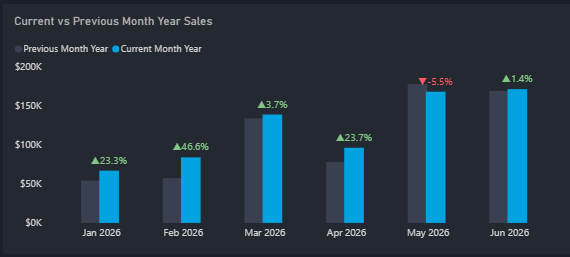
    </td>
    <td width="1000">
      
    </td>
  </tr>
</table>
<table>
  <tr>
    <td>
      <strong>Year-over-Year Growth</strong>
      <ol>
        <li>We may look like achieved strong initial momentum before growth normalized later in the period
          <ul>
            <li>Based on the chart, we have Monthly YoY growth: Jan +23.3%, Feb +46.6%, Mar +3.7%, Apr +23.7%, May -5.5%, Jun +1.4%.</li>
            <li>May was the first down month of the year (-5.5%), and June's recovery (+1.4%) was only partial.</li>
            <strong>What was really happening :</strong>  
              <li> Starting from January 2026, there were some price changes for almost all of the products. Highest price change was in Lower Manhattan. For example, the price of Brazillian Organic Coffee Beans increased from 18USD in Dec 2025 to 22.68USD in Jan 2026 and rose again to 25.51USD in Feb 2026 and 28.35 in March 2026 and soared to 36.85USD in Apr 2026. The price decreased in May 2026 from 36.85 USD to 31.18USD and decreased again to 25.51USD in Jun 2026 </li>
            <li>Meanwhile in Hell's Kitchen, the price of Brazillian Organic Coffee Beans decreased from 18USD in Dec 2025 to 12.67USD in Jan 2026 but increased to 14.26USD and 15.48USD in Feb 2026 and Mar 2026. The price soared to 20.59USD in Apr 2026 before decreased to 17.42USD and 14.26USD in May 2026 and Jun 2026  </li>
            <li>In Astoria, the price plummeted from 18USD in Dec 2025 to 8.44USD in Jan 2026 before rose steadily to 9.49USD in Feb 2026, 10.55 USD in Mar 2026 and peaked to 13.71USD in Apr 2026. Then it decreased in May 2026 to 11.60USD and again to 9.49USD in Jun 2026.</li>
          </ul>
        </li>
        <li>Transactions and Units Sold show steady increase from Jan to Jun 2026, indicating strong customer demand but different behaviour (due to decreasing AOV and Basket Size in general)
          <ul>
            <li>Although there are some issues in product pricing data across 3 areas, customers still choose to buy from us. But the overall Avg Order Value fell 1.4%. Breaking down on this, it shows that biggest dip of AOV is in Astoria from 44.96USD to 2.85USD (fell 42.5% vs Prev Year), while Hell's Kitchen dip from 4.93USD to 4.26USD (fell 13.6%). In contrast, Lower Manhattan AOV soared from 4.92USD to 7.61USD (rise 54.6%). </li>
          </ul>
        </li>
      </ol>
    </td>
  </tr>
</table>

<table align="center">
  <tr>
    <h1 align="center">Store Performance</h1>
    <td width="500">
      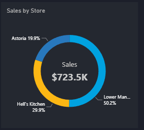
    </td>
    <td width="500">
      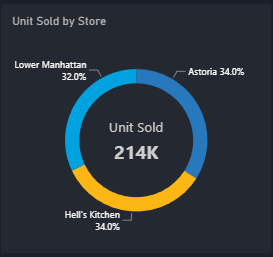
    </td>
  </tr>
</table>
<table>
  <tr>
    <td>
      <ul>
        <li>Lower Manhattan leads revenue (50.2% of sales) but not volume (32.0% of units sold). Astoria and Hell's Kitchen each move 34.0% of units but capture only 19.9% and 29.9% of revenue respectively.</li>
        <li>Combining the two donuts gives implied sales-per-unit: Lower Manhattan ≈$5.29, Hell's Kitchen ≈$2.97, Astoria ≈$1.98 while Lower Manhattan earns roughly 2.7x more per unit sold than Astoria despite selling fewer units.</li>
      </ul>
      <blockquote>
        <strong>Data Quality Flag? Store Pricing Gap</strong> 
        Reconciling against the raw transaction data ruled out product mix as the explanation (category mix is ~38-39% Coffee, ~20-22% Tea, ~17-19% Bakery at all three stores). What differs is price: for the identical product, at the same period, starting from Jan 2026, Hell's Kitchen runs ≈1.5× Astoria's price and Lower Manhattan ≈2.69× Astoria's, holding consistently across nearly the entire ~80-item menu (e.g. a Cappuccino: $2.40 Astoria / $3.60 Hell's Kitchen / $6.33 Lower Manhattan).
          
        <strong>How this was traced:</strong>
        <ol>
          <li>The Overview donuts flagged the sales-share vs. unit-share mismatch for Lower Manhattan.</li>
          <li>Product mix was checked first and ruled that category splits are nearly identical store to store.</li>
          <li>Per-product pricing manual check showed a highly consistent multiplier across ~80 SKUs.</li>
          <li>Sanity-check against real-world US coffee-retail norms: geographic pricing typically runs 10-20%, rarely above 25-30%. A 169% premium (2.69×) difference is far outside that range.</li>
          <li>Hell's Kitchen and Lower Manhattan are <em>both</em> Manhattan locations yet carry very different multipliers (1.5× vs 2.69×), is it because of genuine rent-based pricing? Because it would be expected to cluster the two Manhattan stores together, not split them this sharply.</li>
        </ol>
        <strong>Conclusion:</strong> this pattern is too large and too internally inconsistent to represent genuine product pricing strategy. It is treated as an unverified, likely data-quality finding, pending an audit against Blue Barrel's actual POS price lists.
      </blockquote>
    </td>
  </tr>
</table>

<table align="center">
  <tr>
    <h1 align="center">Product & Assortment</h1>
    <td width="500">
      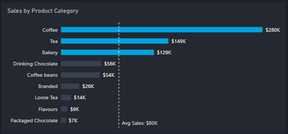
    </td>
    <td width="500">
      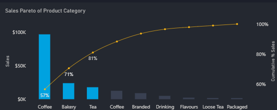
    </td>
  </tr>
</table>
<table>
  <tr>
    <td>
      <ul>
        <li>Coffee, Tea and Bakery are the revenue core: $279,921 (38.7%), $149,291, and $129,159 respectively, together ~77% of YTD revenue and all three above the $80K average-sales line.</li>
        <li>The Jun 2026 Sales Pareto shows Coffee alone at 57% cumulative, reaching 81% by Tea. The remaining six categories make up the 19% sales.</li>
        <li>Meanwhile, Loose Tea and Packaged Chocolate have the lowest selling product category across 6 months. This shows a clear sign of product replacement/reposition. </li>
      </ul>
    </td>
  </tr>
</table>

<table align="center">
  <tr>
    <td width="500">
      <h3>Top 5 Products (June, MoM)</h3>
      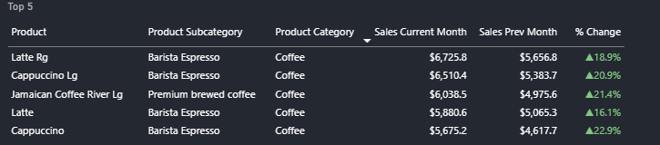
    </td>
    <td width="500">
      <h3>Bottom 5 Products (June, MoM)</h3>
      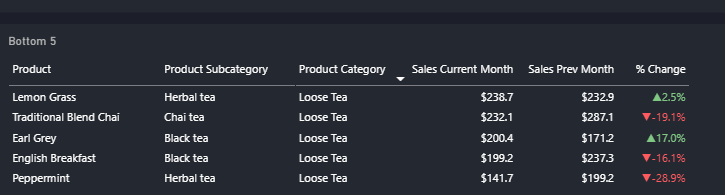
    </td>
  </tr>
</table>
<table>
  <tr>
    <td>
      <ul>
        <li>June's growth was carried entirely by espresso drinks. The Top 5 table is exclusively Barista Espresso items, up 16–23% month-over-month (Cappuccino +22.9%, Jamaican Coffee River Lg +21.4%).</li>
        <li>The Bottom 5 is exclusively Loose Tea, mostly declining (Peppermint -28.9%, Traditional Blend Chai -19.1%, English Breakfast -16.1%), a signal these SKUs need repositioning or replacement.</li>
      </ul>
    </td>
  </tr>
</table>

<table align="center">
  <h1 align="center">Demand & Traffic</h1>
  <tr>
    <td width="500">
       

      <h3>Hourly Traffic Heatmap (June)</h3>
      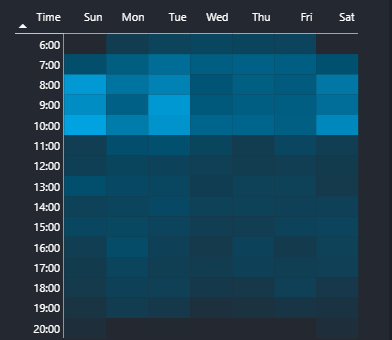
    

    </td>
    <td valign="top" width="500">
      

        <h3>Sales Peak Calendar (June)</h3>
        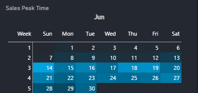
      

    </td>
  </tr>
</table>
<table>
  <tr>
    <td>
      <ul>
        <li>Morning is the peak traffic window, every day of the week. The heaviest traffic clusters 7:00–10:00 AM across all seven days, including Sunday, which is tied with Tuesday for the single busiest hour-slot in the underlying data.</li>
        <li>Traffic tapers steadily through the afternoon after 1:00 PM and thins to near-empty by 18:00–20:00.</li>
        <li>The calendar highlights the week of June 14–20 as an elevated-sales stretch, consistent with the day-14 step-change seen in the Sales by Day chart.</li>
        <li>Across 6 months (Jan-Jun 2026), our shop was the busiest in week 3-4 overall. While week 1 and week 2 seldom busy. This is a clear sign for marketing team to create promotion/bundling at the start of the month. </li>
      </ul>
    </td>
  </tr>
</table>

<table align="center">
    <h1>Recommendations</h1>
    <h4>Based on the uncovered insights, here are actionable items Blue Barrel Coffee can take away from this analysis.</h4>
</table>

<table>
  <thead>
    <tr>
      <th align="center">Priority</th>
      <th align="left">Action</th>
      <th align="left">Owner</th>
      <th align="left">Expected Impact</th>
      <th align="left">Metric to Track</th>
    </tr>
  </thead>
  <tbody>
    <tr>
      <td align="center"><strong>P0</strong></td>
      <td><strong>Audit store-level pricing:</strong> Reconcile the ≈1.5×/2.69× Astoria, Hell's Kitchen, and Lower Manhattan price multipliers against Blue Barrel's actual POS/menu records before any pricing or "replicate Lower Manhattan" decision is made.</td>
      <td>Data / Finance</td>
      <td>De-risks up to <strong>~$228K</strong> of Lower Manhattan's H1 sales (~$456K annualized) currently sitting on an unverified pricing basis</td>
      <td>Store price variance vs. POS master list (Target: 0% unexplained variance)</td>
    </tr>
    <tr>
      <td align="center"><strong>P0</strong></td>
      <td><strong>Investigate the June 14 demand step-change:</strong> Identify the promotion, staffing change, or event behind the shift from ~$3.7K/day to ~$7.2K/day, and design a plan to trigger it from day 1 of future months.</td>
      <td>Store Ops / Marketing</td>
      <td><strong>~$46K/month</strong> potential uplift if the day-14+ sales rate is sustained for a full month (~$550K/year if repeatable)</td>
      <td>Daily sales vs. $6.5K/day target (days 1–13 specifically)</td>
    </tr>
    <tr>
      <td align="center">P1</td>
      <td><strong>Correct and recompute, if confirmed an error:</strong> If the pricing audit finds a data/system issue, fix the source records and re-run every store-level KPI and comparison in this report.</td>
      <td>Data / BI</td>
      <td>Restores trust in store leaderboard; prevents decisions built on an inflated Lower Manhattan revenue figure</td>
      <td>KPI reconciliation delta (Target: &lt;1% variance)</td>
    </tr>
    <tr>
      <td align="center">P1</td>
      <td><strong>Align staffing to the 6-10 AM peak:</strong> Shift labor hours toward the confirmed busiest window (all 7 days including Sunday) on week 3 and week 4 (for now) and reduce staffing after 1:00 PM.</td>
      <td>Store Ops</td>
      <td>Improves service speed and conversion during the single busiest, most consistent traffic block; reduces low-traffic labor cost</td>
      <td>Transactions per labor hour, 6-10 AM window</td>
    </tr>
    <tr>
      <td align="center">P1</td>
      <td><strong>Register-level upsell prompts:</strong> Pair high-frequency Coffee purchases with higher-AOV Bakery / Coffee-beans add-ons to rebuild basket value.</td>
      <td>Marketing / Store Ops</td>
      <td><strong>~$6K/month</strong> if June's AOV is restored to May's $5.00 level (~$72K/year)</td>
      <td>Avg Order Value (Target: $5.00)</td>
    </tr>
    <tr>
      <td align="center">P2</td>
      <td><strong>Benchmark pricing, if confirmed genuine:</strong> If the store price multiplier is real, compare it against local NYC competitors and gather customer feedback before treating it as sound strategy.</td>
      <td>Marketing / Finance</td>
      <td>Confirms whether a ~169% premium over Astoria is sustainable without demand or reputational risk</td>
      <td>Local competitor price index; customer sentiment</td>
    </tr>
    <tr>
      <td align="center">P2</td>
      <td><strong>Create loyalty program :</strong> To compare the AOV and ABS of customers who joined loyalty program vs non-loyalty program</td>
      <td>Marketing</td>
      <td>More detailed customer behavior/segmentation. This would help marketing team to save marketing costs.</td>
      <td>Cohort Analysis | Repurchase Rate</td>
    </tr>
    <tr>
      <td align="center">P2</td>
      <td><strong>Review underperforming Loose Tea SKUs:</strong> Reposition, bundle with Coffee traffic, or replace Peppermint, Traditional Blend Chai, and English Breakfast.</td>
      <td>Product / Merchandising</td>
      <td>Stops further erosion in a small ($13.9K YTD) category; frees menu space for higher-turnover items</td>
      <td>Loose Tea SKU-level MoM sales trend</td>
    </tr>
  </tbody>
</table>

<h2 align="center">What I would do for next iteration on this project</h2>

1. Ask Store Ops to separate beverage and add ons (coffee + maple syrup for example), to get customer behavior through attach-rate.  
2. Ask the company to give the full data, including customerID, discount (if any) so I can calculate cohort analysis and repurchase rate.  
3. Build a small, automated, cost-optimized data warehouse to consolidate the sales report from POS to create centralized report/dashboard like this, refreshed daily in the morning, including alert for if the sales trend decline.

<h3 align="center">Dataset Structure</h3>

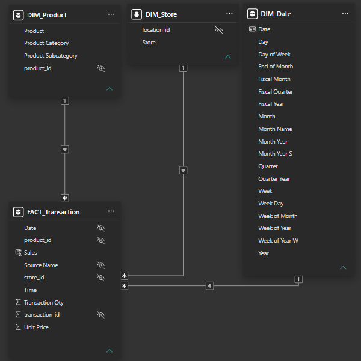

<body>The data model consists of four tables:  
1. FACT_Transaction (line-item transaction records: date, time, store, product, unit price, quantity)
 
2. DIM_Product (category and subcategory)
 
3. DIM_Store (location name), and
 
4. DIM_Date (the date table)
   
With a total of roughly 426,000 transaction rows spanning January 2025 to June 2026. Findings above are drawn from three Power BI report pages: Sales Overview (YTD), Monthly Analysis (MTD, June 2026), and Demand & Traffic (MTD, June 2026), and every figure was independently reconciled against the raw transaction excel files.</body>